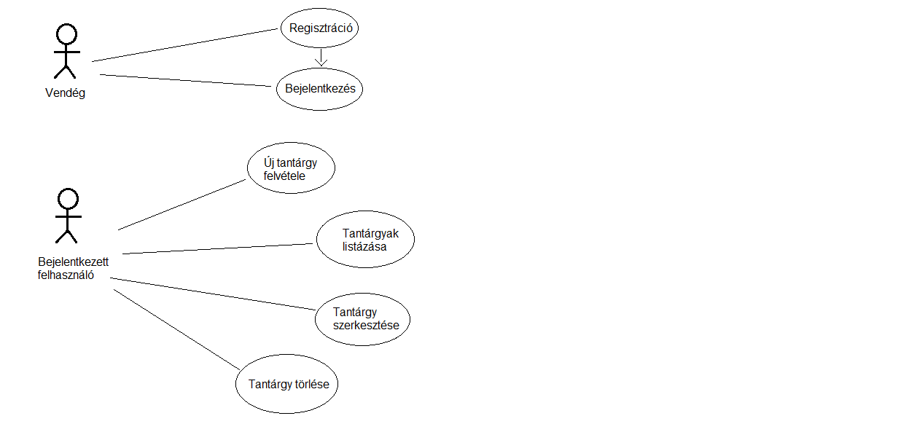
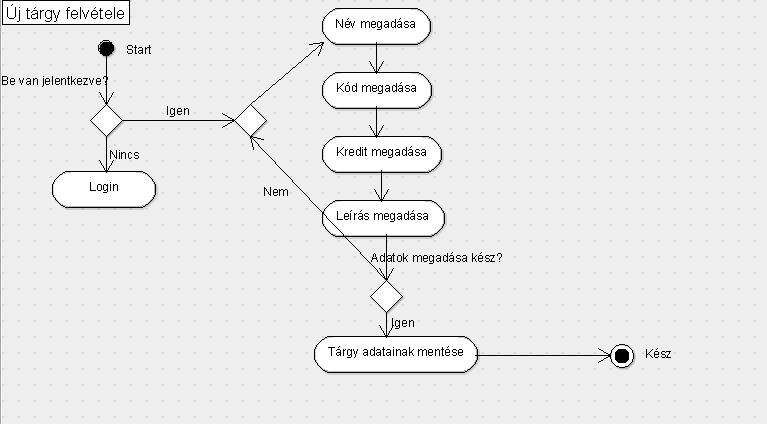
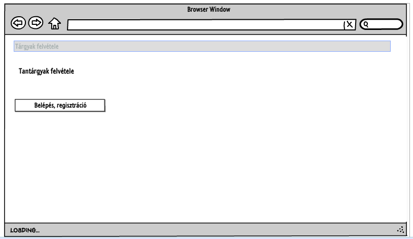
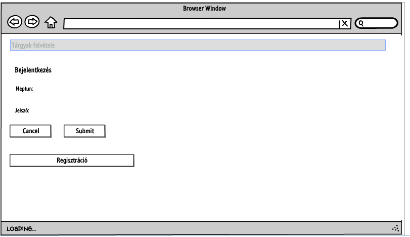
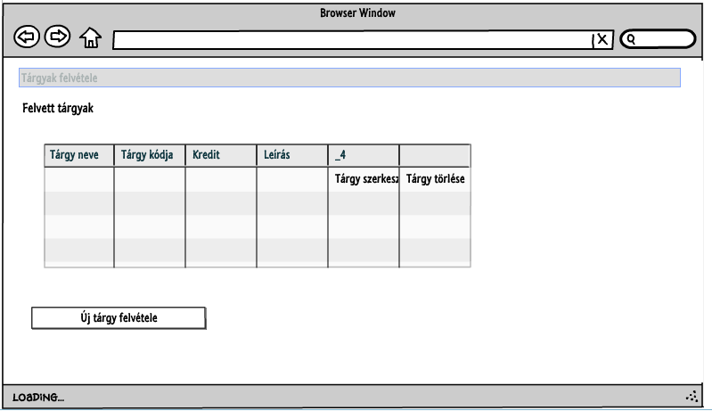
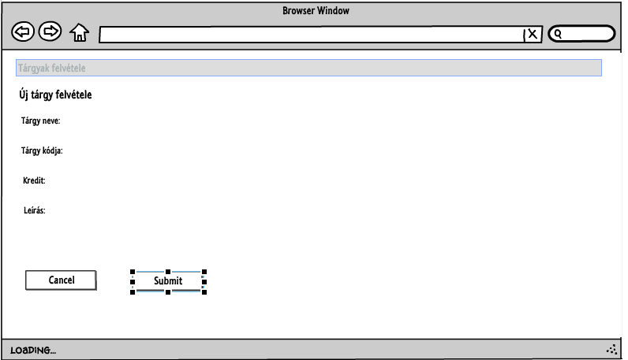
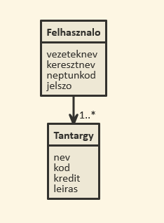
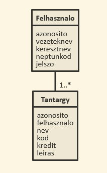
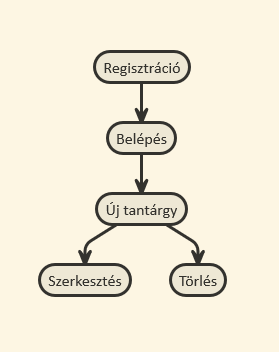
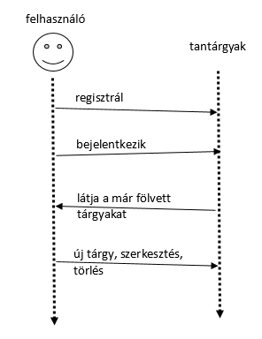

# Dokumentáció

## 1. Követelményanalízis

### 1.1. Követelmények összegyűjtése
#### 1.1.1. Funkcionális elvárások
Egy kis webes alkalmazás elkészítése a cél szerveroldali technológiák segítségével.
- Az alkalmazással a regisztrált felhasználók tudjanak felvenni, szerkeszteni, törölni tantárgyakat.
- Legyen lehetőség regisztrációra.
- Bizonyos funkciók csak regisztrációt követően legyenek elérhetőek: 
    - új tantárgy felvétele
    - tantárgy módosítása
    - tantárgy törlése
    - felvett tantárgyak listázása

#### 1.1.2. Nem funkcionális követelmények
- Használhatóság: a látogatók által elért felület legyen jól átlátható, önmagyarázó (egy átlagos látogató felhasználói dokumentáció nélkül is tudja használni).
- Biztonság: a felhasználók jelszavai ne legyenek visszafejthetőek. 
- Karbantarthatóság: a weboldal legyen könnyen bővíthető. Egy új oldallal, menüvel, vagy használati esettel való bővítés legyen egyértelmű, és gyorsan végrehajtható.

### 1.2. Szakterületi fogalomjegyzék

### 1.3. Használatieset-modell
#### 1.3.1. Szerepkörök
Vendég: Az a felhasználó, aki azonosítatlanul használja az alkalmazást. A vendég felhasználó csak a publikus oldalakat és funkciókat érheti el. Ilyenek a bejelentkezés és regisztráció.
Bejelentkezett felhasználó: Felvehet új tantárgyat, a listázási és szerkesztési oldalakat is használhatja.

#### 1.3.2. Használati eset diagramok

#### 1.3.3. Folyamatok pontos menete

Cím: Új tárgy felvétele
Cél: Új tantárgy felvétele.
Előfeltétel: Csak belépett felhasználó tud új tantrágyat fölvenni.
Utófeltétel: A tárgy mentése sikeres.

Folyamat leírása:
Az alábbi lépések végrehajtása szükséges:
- Az alábbi adatokat kell a felhasználónak kötelezően megadnia egy új bemutató készítésekor: név, kód, kredit.
- Opcionális adatok: leírás
- Tantárgy mentése

## 2. Tervezés

### 2.1. Architektúra terv
#### 2.1.1. Komponensdiagram

#### 2.1.2. Oldaltérkép
Publikus:
- Főoldal
- Login
- Registráció

Csak bejelentkezettek látják:
- Tárgyak listája
    - új tárgy
    - tárgy szerkesztése
    - tárgy törlése

#### 2.1.3. Végpontok
GET /: főoldal
GET /login: bejelentkező oldal
GET /signup: regisztráló oldal
POST /login: bejelentkezési adatok elküldése
POST /signup: regisztrációs adatok elküldése
GET /errors/list: saját tárgylista oldal
GET /errors/new: új tárgy felvitele
POST /errors/new: új tárgy felvitele, adatok küldése
GET /errors/edit: tárgy szerkesztése
POST /errors/edit: tárgy szerkesztése, adatok küldése

### 2.2. Felhasználóifelület-modell
Főoldal

Login

Regisztráció

Lista 

Új tárgy felvétele, tárgy szerkesztese

### 2.3. Osztálymodell
#### 2.3.1. Adatmodell

#### 2.3.2. Adatbázisterv

#####Táblák
Felhasznalo
Leírás: A felhasználó adatai ebben a táblában kerülnek tárolásra.
Attribútumok:
    - id (egész): felhasználó azonosítója az adatbázisban
    - vezeteknev (szöveg(30)): felhasználó vezetékneve
    - keresztnev (szöveg(30)): felhasználó keresztneve
    - neptunkod (szöveg(6)): felhasználó neptunkódja
    - jelszo (szöveg(20)): a felhasználó jelszava (kódolt)
    
Tantargy
Leírás: A tantárgy adatai ebben a táblában kerülnek tárolásra.
Attribútumok:
    - id (egész): tantárgy azonosítója az adatbázisban
    - felhasznalo: melyik felhasználó vette fel a tárgyat
    - nev (szöveg(30)): tantárgy neve
    - kod (szöveg(30)): tantárgy kódja
    - kredit (egész): tantárgy kreditértéke
    - leiras (szöveg(60)): a tantárgy részletesebb leírása
Kapcsolatok: TantargyToFelhasznalo

#### 2.3.3. Állapotdiagram

### 2.4. Dinamikus működés
#### 2.4.1. Szekvenciadiagram

## 3. Implementáció

### 3.1. Fejlesztői környezet bemutatása
Nodejs fejlesztői környezetben szerves oldali javascript-el lett megírva a program.

### 3.2. Könyvtárstruktúrában lévő mappák funkiójának bemutatása
A controllers mappában található file-ok végzik a végpontok kezelését, az oldalak megjelenítését és az adatok kezelését.
A docs/images mappában vannak a dokumentációhoz szükséges képek és ábrák.
A models mappa tárolja a tantárgyakat és a felhasználókat reprezentáló adatszerkezetek struktúráját.
A views mappa az oldalak kinézetét leíró file-okat tartalmazza.

## 4. Tesztelés

### 4.1. Tesztelési környezet bemutatása
Mocha teszt keretrendszert és chai ellenőrző könyvtárat használok. A tesztfile-ok nevei <valami>.test.js vagy <valami>.spec.js. A teszteket a következő módon lehet futtatni: mocha **/*.test.js.

### 4.2. Egységtesztek (1 adatmodell tesztelése)
Felhasználó adatmodell tesztelése.
A tesztfile a models mappában található user.test.js néven. Létrehoz egy új felhasználót, majd megpróbálja megkeresni, ezután pedig ellenőrzi, hogy
ha megkeresi a felhasználót, akkor megfelelő jelszó tartozik-e hozzá. 

### 4.3. Funkcionális felületi tesztek (1 folyamat tesztelése)
A tesztfile a test.js néven található. Először a kezdőoldalra megy, ott ellenőrzi, hogy oda került-e. Majd megpróbálja elérni a tárgyakat listázó oldalt, de mivel még nincs bejelentkezve, ezért visszakerül a bejelentkező oldalra. Ott bejelentkezik egy már regisztrált felhasználóval és a tantárgakat listázó oldalra kerül. Ezután felvesz egy új tantárgyat.

### 4.4. Tesztesetek felsorolása
- egységteszt: user.test.js
- funcionális teszt: test.js
- tesztesetek nem készültek róla, de ki lett próbálva: 
        - felhasználó regisztrálása (még nem létező, illetve már létező - utóbbi nem megengedett)
        - tantárgyak szerkesztése
        - tantárgyak törlése
        - kilépés

## 5. Felhasználói dokumentáció
### 5.1. A program használata
A kezdőoldalról elérhető a belépés oldal. Ha már van regisztrált felhasználó, azzal ott kell belépni. Ha még nincs, vagy pedig új valami szeretne regisztrálni, az a regisztráció gombra kattintva átkerül a regisztrációs oldalra. Ott meg kell adnia a vezetéknevét, a keresztnevét, a neptun kódot, illetve a jelszót. Mindegyik mező kötelező, de csak a neptun kódnak kell egyedinek lennie.
Sikeres regisztráció esetén visszakerülünk a bejelentkező oldalra, ahol már bejelentkezhet.
Sikertelen regisztráció esetén (már létezett az a neptun kód, vagy valamelyik adat nem volt megadva) ottmaradunk a regisztrációs oldalon.
Bejelentkezés után látjuk azokat a tantárgyakat, amit a felhasználó már létrehozott. Lehetőség van új tantárgy felvételére, meglévő szerkesztésére és törlésére.
Új tantárgy felvételekor meg kell adni a tárgy nevét, a kódját, a kreditértékét és leírást is lehet adni hozzá. Az első három tulajdonságot kötelező megadni, leírást nem muszáj. Egyik tulajdonság sem egyedi, azaz két tárgyat is föl lehet venni, aminek minden tulajdonsága megegyezik.
Létező tantárgy szerkesztésekor a szerkeszteni kívánt tantárgy melletti 'Tárgy szerkesztése' gombra kattintva kerülünk a szerkesztés oldalra. Itt már be vannak másolva a mezőkbe a tárgy adatai. Itt lehet őket módosítani, majd a 'Submit' gombbal mentésre kerülnek a változások és visszakerülünk a listázó oldalra.
Létező tantárgy törléséhez a törölni kívánt tantárgy melletti 'Tárgy törlése' gombra kell kattintani. Ekkor továbbra is ottmaradunk a listázó oldalon, de az a tárgy már nem jelenik meg a listában.
